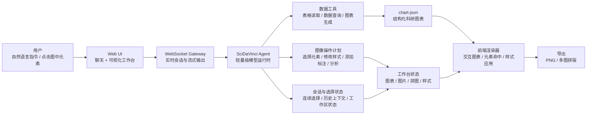
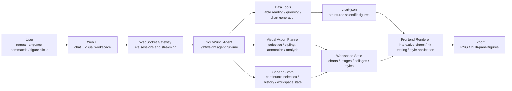

<div align="center">

**中文** | [English](#english)


</div>

## 中文

**SciDaVinci** 是一个基于轻量级 agent 运行时开发的交互式科研绘图与分析平台。它把大模型对话、表格数据分析、可交互科研图表、图像元素选择、连续式图像操作和多图拼版放在同一个工作流里，帮助用户从数据表快速走到可以继续打磨和导出的科研图。

### 核心能力

#### 1. 从表格生成可交互科研绘图

用户可以上传或引用 CSV、TSV、Excel 等表格数据，让模型根据数据内容生成科研图表。生成后的图不是静态图片，而是可交互对象：

- 支持柱状图、折线图、饼图、面积图、箱线图、火山图等图形；
- 模型可以读取完整数据并生成 `chart-json` 结构；
- 前端将图表渲染为可点击、可选择、可继续编辑的视觉资产；
- 用户可以直接点击图中的点、柱子、扇区、标签等元素，继续向模型提问。

目前支持的图表类型：

| 图表类型 | 适合场景 | 交互对象 |
| --- | --- | --- |
| 柱状图 Bar | 分组比较、Top N 排序、表达量或统计量对比 | 单个柱、分组柱 |
| 折线图 Line | 时间序列、处理前后变化、基因表达趋势 | 数据点、折线系列 |
| 饼图 Pie | 类别占比、差异表达类别汇总 | 扇区 |
| 面积图 Area | 连续变化、累积趋势 | 面积系列、数据点 |
| 箱线图 Box | 分布比较、组间差异、异常值观察 | 箱体、离群点 |
| 火山图 Volcano | 差异表达、显著性与 fold change 联合分析 | 基因点、显著性区域 |

例如，用户可以点击火山图中的某个基因点后问：

```text
这个基因为什么被标记为显著？它和其他上调基因相比有什么特点？
```

也可以选中多个元素后问：

```text
请比较我选中的这些基因，它们在 fold change 和显著性上有什么共同点？
```

#### 2. 图像元素级交互与连续操作

SciDaVinci 的重点不是只让模型“看图回答”，而是让模型能够围绕用户意图持续操作图像对象。用户可以通过点击或自然语言指定目标，模型再把意图拆解为一组连续动作，例如选择元素、修改样式、补充标注、重新分析。

一个典型场景：

```text
在这张火山图中选中 CRISPLD2、KLF15 和 PER1，把它们改成红色并加标签，然后分析这些基因和其他显著上调基因的差异。
```

模型需要完成的不是单步回答，而是一个连续工作流：

1. 理解用户要找的基因；
2. 在图表数据中定位对应元素；
3. 将这些元素加入当前选择集；
4. 应用颜色、标签、透明度等样式修改；
5. 基于选中元素与全图背景数据生成分析结论。

这种选择状态可以连续累积。例如用户先说“选中 A 基因”，下一句再说“再选中 B 基因”，此时 A 和 B 都会保留在当前上下文中，模型可以继续对这组元素进行样式调整或生物学解释。

#### 3. 多图拼版

拼图功能是 SciDaVinci 的重要出发点：科研工作中往往不是只需要一张图，而是需要把多个图组织成一组完整的 figure panel。

当前工作台支持：

- 将多个图表、图片或视觉资产加入拼图画布；
- 调整布局、间距、尺寸和背景；
- 将同一批分析结果组织成更适合论文、组会或汇报的多面板图；
- 一键导出 PNG，减少在外部软件中反复拖拽和对齐的时间。

### 示例工作流

```text
请读取 demo_data/interactive_charts/volcano_markers.csv，生成一张火山图，突出上调和下调 marker。
```

```text
选中 GENE_A、GENE_B 和 GENE_D，把它们改成红色并加标签。
```

```text
继续选中 GENE_E，把这四个 marker 和其他显著变化 marker 做比较。
```

```text
再用 demo_data/interactive_charts/bar_top_markers.csv 生成一张柱状图，然后把火山图和柱状图拼成一个 1x2 的 figure panel。
```

### 项目架构



### Demo 数据

仓库内置了一个精简的合成示例数据集：[`demo_data/interactive_charts`](./demo_data/interactive_charts)。

这些 CSV 不依赖真实论文数据，适合作为公开 README、CI 和交互图演示的最小样例。它包含：

- `volcano_markers.csv`：火山图；
- `bar_top_markers.csv`：Top changed markers 柱状图；
- `line_timecourse.csv`：时间趋势折线图；
- `pie_marker_categories.csv`：分类占比饼图；
- `box_group_distribution.csv`：分组分布箱线图；
- `area_signal_trend.csv`：趋势面积图。

### 快速开始

安装源码版本：

```bash
git clone https://github.com/raymkf/scidavinci.git
cd scidavinci
pip install -e .
```

初始化本地工作区：

```bash
scidavinci onboard
```

在 `~/.scidavinci/config.json` 中配置模型，例如 OpenRouter：

```json
{
  "providers": {
    "openrouter": {
      "apiKey": "<your-openrouter-api-key>"
    }
  },
  "agents": {
    "defaults": {
      "provider": "openrouter",
      "model": "anthropic/claude-opus-4-6"
    }
  }
}
```

启动命令行对话：

```bash
scidavinci agent
```

### Web UI 开发运行

在 `~/.scidavinci/config.json` 中启用 WebSocket：

```json
{
  "channels": {
    "websocket": {
      "enabled": true
    }
  }
}
```

启动 gateway：

```bash
scidavinci gateway
```

启动前端：

```bash
cd webui
bun install
bun run dev
```

打开 Vite 输出的本地地址，通常是 `http://localhost:5173`。

### 仓库结构

```text
.
├── nanobot/                 # 内部 agent 运行时、工具、通道、记忆和技能
├── webui/                   # React/Vite 可视化工作台
├── bridge/                  # 部分聊天集成使用的 TypeScript bridge
├── demo_data/interactive_charts/  # 精简合成交互图 demo 数据
├── docs/                    # SciDaVinci 公开文档
├── tests/                   # Python 测试
├── images/                  # README 与产品图片
└── pyproject.toml           # Python 包配置
```

### 开发

```bash
pip install -e ".[dev]"
pytest
```

```bash
cd webui
bun install
bun run test
bun run build
```

### Roadmap

- 完成更多公开文档、示例数据和图表模板；
- 强化图中元素选择、连续选择和多元素分析；
- 让模型操作结果与工作台状态更严格同步；
- 扩展更多科研绘图模板和期刊风格预设；
- 完善多图拼版、导出尺寸、图注和 panel label；
- 增强模型对图像、表格和生物学背景之间关系的分析能力。

### 许可证与致谢

本项目基于 MIT License 发布，详见 [`LICENSE`](./LICENSE) 与 [`THIRD_PARTY_NOTICES.md`](./THIRD_PARTY_NOTICES.md)。

SciDaVinci 基于开源项目 `nanobot` 的轻量级 agent 架构继续开发，并在此基础上扩展交互式科研绘图、图像元素级分析和多图拼版能力。

---

## English

[中文](#中文) | **English**

**SciDaVinci** is an interactive scientific plotting and analysis platform built on top of a lightweight agent runtime. It brings model-driven chat, tabular data analysis, interactive research figures, element-level visual selection, continuous chart editing, and multi-panel figure composition into one workflow.

### Core Capabilities

#### 1. Generate Interactive Scientific Figures From Tables

Users can upload or reference CSV, TSV, and Excel datasets, then ask the model to create research figures from the data. The generated result is not just a static image. It becomes an interactive visual asset:

- bar, line, pie, area, box, and volcano plots;
- chart generation from full datasets through structured `chart-json`;
- frontend rendering with clickable and editable visual elements;
- follow-up questions directly grounded in selected points, bars, slices, labels, or other figure elements.

Currently supported chart types:

| Chart type | Best for | Interactive elements |
| --- | --- | --- |
| Bar | Group comparison, Top N ranking, expression or statistic comparison | Individual bars, grouped bars |
| Line | Time series, before/after changes, gene expression trends | Data points, line series |
| Pie | Category proportions and DEG category summaries | Slices |
| Area | Continuous changes and cumulative trends | Area series, data points |
| Box | Distribution comparison, group differences, outlier inspection | Boxes, outliers |
| Volcano | Differential expression, significance and fold-change analysis | Gene points, significance regions |

Example:

```text
Why is this selected gene marked as significant, and how does it compare with the other up-regulated genes?
```

Users can also select multiple elements and ask:

```text
Compare the genes I selected. What do they have in common in fold change and statistical significance?
```

#### 2. Element-Level Visual Interaction And Continuous Editing

SciDaVinci is designed for more than visual question answering. The model can interpret user intent and turn it into a sequence of visual operations: selecting elements, changing styles, adding labels, updating annotations, and producing analysis grounded in the selected subset.

A typical volcano plot workflow:

```text
In this volcano plot, select CRISPLD2, KLF15, and PER1, color them red, add labels, and analyze how these genes differ from the other significant up-regulated genes.
```

The model-driven workflow is:

1. understand which genes the user wants;
2. locate the corresponding elements in the chart data;
3. add those elements to the current selection set;
4. apply style changes such as color, labels, and opacity;
5. analyze the selected elements against the broader dataset.

The selection state can be continuous. If the user first selects gene A and then says “also select gene B,” both A and B remain selected for later editing or analysis.

#### 3. Multi-Panel Figure Composition

The collage feature is one of the original motivations for SciDaVinci. Scientific work rarely ends with a single chart; users often need to assemble several polished plots into one figure panel.

The visual workspace currently supports:

- adding charts, images, and other visual assets to a collage canvas;
- adjusting layout, spacing, size, and background;
- turning related analyses into a paper, lab meeting, or presentation-ready figure panel;
- exporting the composed figure as PNG.

### Example Workflow

```text
Read demo_data/interactive_charts/volcano_markers.csv and create a volcano plot highlighting up-regulated and down-regulated markers.
```

```text
Select GENE_A, GENE_B, and GENE_D, color them red, and add labels.
```

```text
Also select GENE_E, then compare these four markers with the other significantly changed markers.
```

```text
Create a bar chart from demo_data/interactive_charts/bar_top_markers.csv, then combine the volcano plot and the bar chart into a 1x2 figure panel.
```

### Architecture



### Demo Data

The repository includes a compact synthetic demo dataset under [`demo_data/interactive_charts`](./demo_data/interactive_charts).

These CSV files avoid real paper data and are intended for public README examples, CI, and interactive chart demos:

- `volcano_markers.csv` for a volcano plot;
- `bar_top_markers.csv` for top changed markers;
- `line_timecourse.csv` for line charts;
- `pie_marker_categories.csv` for pie charts;
- `box_group_distribution.csv` for box plots;
- `area_signal_trend.csv` for area charts.

### Quick Start

Install from source:

```bash
git clone https://github.com/raymkf/scidavinci.git
cd scidavinci
pip install -e .
```

Initialize the local workspace:

```bash
scidavinci onboard
```

Configure a model in `~/.scidavinci/config.json`, for example with OpenRouter:

```json
{
  "providers": {
    "openrouter": {
      "apiKey": "<your-openrouter-api-key>"
    }
  },
  "agents": {
    "defaults": {
      "provider": "openrouter",
      "model": "anthropic/claude-opus-4-6"
    }
  }
}
```

Start terminal chat:

```bash
scidavinci agent
```

### Web UI Development

Enable the WebSocket channel in `~/.scidavinci/config.json`:

```json
{
  "channels": {
    "websocket": {
      "enabled": true
    }
  }
}
```

Start the gateway:

```bash
scidavinci gateway
```

Start the frontend:

```bash
cd webui
bun install
bun run dev
```

Open the local Vite URL, usually `http://localhost:5173`.

### Repository Layout

```text
.
├── nanobot/                 # internal agent runtime, tools, channels, memory, skills
├── webui/                   # React/Vite visual workspace
├── bridge/                  # TypeScript bridge for selected chat integrations
├── demo_data/interactive_charts/  # compact synthetic interactive chart demo data
├── docs/                    # SciDaVinci public docs
├── tests/                   # Python tests
├── images/                  # README and product images
└── pyproject.toml           # Python package metadata
```

### Development

```bash
pip install -e ".[dev]"
pytest
```

```bash
cd webui
bun install
bun run test
bun run build
```

### Roadmap

- Add more public docs, demo datasets, and chart templates;
- strengthen figure element selection, continuous selection, and multi-element analysis;
- synchronize model actions with visual workspace state more strictly;
- add more scientific plotting templates and journal-style presets;
- improve collage layout, export sizing, captions, and panel labels;
- deepen model analysis across figures, tables, and biological context.

### License And Acknowledgements

This project is released under the MIT License. See [`LICENSE`](./LICENSE) and [`THIRD_PARTY_NOTICES.md`](./THIRD_PARTY_NOTICES.md).

SciDaVinci is built on top of the lightweight open-source `nanobot` agent architecture, extending it with interactive scientific plotting, element-level visual analysis, and multi-panel figure composition.
