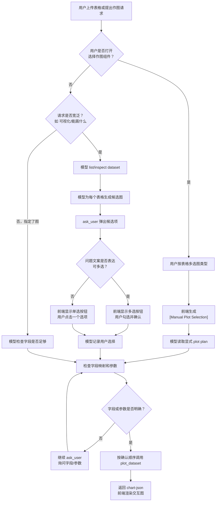

# 图表选择与确认流程设计

本文档记录 SciDaVinci 当前“先确认再作图”的设计逻辑。它不描述新增图表类型本身，而是描述用户上传表格后，系统如何在模型推荐、用户手动选择、多表格、多图输出之间保持一致的作图计划。

## 设计目标

- 避免用户只说“可视化这个表格”时，模型直接生成单一图表，错过更合适或用户真正想要的图。
- 支持同一张表生成多张图，而不是把“推荐图”压缩成一个最终选择。
- 支持一次上传多个表格，每个表格分别确认要生成的图。
- 让模型推荐路径和用户手动选择路径最终进入同一类 plot plan，后续字段确认和作图执行可以复用。
- 聊天窗口中的候选项只能来自当前上下文中模型推荐或用户显式选择的图，不展示未被提及的完整图表库。

## 当前能力边界

当前交互流程只开放已经可以执行的图表类型：

- Bar
- Line
- Pie
- Area
- Box
- Volcano

Scatter、Violin、Heatmap、PCA Plot、Correlation Heatmap、Venn、UpSet 等生信图类型会在后续图表渲染能力扩展时加入，不属于本轮流程底座的可执行范围。

## 两条入口

系统支持两种进入作图计划的方式。

### 模型推荐入口

当用户提出宽泛请求，例如：

```text
帮我可视化这个表格
这个数据能画什么图？
上传了几个表格，你看着出图
```

模型不应立即作图，而应：

1. 使用数据集工具读取已上传表格列表和字段结构。
2. 根据每个表格的列类型、行数和常见字段语义判断候选图。
3. 用 `ask_user` 询问用户要生成哪些图。
4. 如果用户表达多图需求，问题文案需要包含“多选”“多个图”“one or more”等语义，前端会把按钮切换为可勾选的多选确认。
5. 用户确认后，模型记录选择并继续字段确认或直接作图。

### 用户手动选择入口

聊天输入区提供“选择作图”组件。用户可以不等待模型推荐，直接为一个或多个表格选择图表。

组件行为：

- 展示当前待上传的表格。
- 展示本会话已经上传过的表格。
- 每个表格下可多选当前可执行的 6 类图。
- 每个图类型卡片包含名称、说明和缩略图。
- 用户确认后，前端生成结构化 `[Manual Plot Selection]` 计划发给模型。
- 模型把该结构视为显式 plot plan，只能生成用户选择过的图。

## 总流程



## ask_user 多选规则

前端 `AskUserPrompt` 的选择模式由问题文案触发。

当问题中包含以下语义时，按钮从单选变成多选：

- `多选`
- `一个或多个`
- `多个图`
- `multiple`
- `one or more`
- `select ... more`

多选模式下：

- 用户点击按钮只改变勾选状态，不会立刻发送。
- 用户点击 `Confirm selection` 后，前端发送类似：

```text
Selected: Bar, Box, Volcano
```

模型需要把这句话解释为本轮候选项中的多项选择，而不是普通自然语言。

## 手动选择组件的 plot plan

手动组件发给模型的内容形如：

```text
[Manual Plot Selection]
{
  "intent": "manual_plot_selection",
  "selectedCharts": [
    {
      "fileName": "deg_results.csv",
      "datasetSource": "attached",
      "chartTypes": ["volcano", "bar"]
    },
    {
      "fileName": "summary.csv",
      "datasetSource": "uploaded",
      "chartTypes": ["pie"]
    }
  ],
  "instructions": [
    "Use list_datasets first and match each fileName to the available dataset_id.",
    "Only generate the chart types selected by the user.",
    "For each selected chart, inspect the dataset and ask the user for field/parameter choices if the mapping is ambiguous.",
    "If all required fields are clear, call plot_dataset for each confirmed chart and return the chart-json blocks in the selected order."
  ]
}
```

这段内容是模型可见的隐藏上下文。用户气泡只显示简短摘要，例如：

```text
选择作图：
deg_results.csv: volcano, bar
summary.csv: pie
```

## 多表格规则

无论来自模型推荐还是手动组件，多表格都按以下规则处理：

- 每个表格都有独立的候选图或已选图。
- 任务记录必须保留 `fileName` 或 `dataset_id`，避免字段映射串表。
- 用户可以为不同表格选择不同图。
- 用户可以跳过某个表格。
- 字段确认按表格和图类型分别进行。
- 所有必要信息确认后，再按用户选择顺序作图。

## 模型行为约束

模型收到作图请求时应遵守：

- 宽泛请求先推荐候选图并询问用户，不直接作图。
- 明确请求可以直接进入字段检查，例如“画火山图”。
- 手动组件发来的 `[Manual Plot Selection]` 是显式计划，不能额外生成未选择的图。
- 若字段映射不明确，继续用 `ask_user` 追问，而不是猜测。
- 若字段明确，调用 `plot_dataset`，并把返回的 `chart-json` 原样放进最终回复。
- 多图输出时，每个图都是独立任务，不能相互覆盖。

## 前端状态与展示原则

- 附件可以在发送前以气泡形式展示。
- 已上传过的表格会在后续“选择作图”组件里作为可选数据源出现。
- 手动组件只展示当前可执行图类型，不提前展示尚未实现的生信图类型。
- 缩略图用于表达图形结构，不使用用户真实数据。
- 结构化 plot plan 和模型隐藏指令不应暴露在用户气泡中。

## 与后续图类型扩展的关系

新增图类型时，优先更新三个位置：

1. 图表渲染和 `chart-json`/`plot_dataset` 支持。
2. 手动选择组件中的图类型卡片和缩略图。
3. 模型推荐候选图的判断规则。

只有当某个图类型真正可执行后，才应出现在手动选择组件中。
